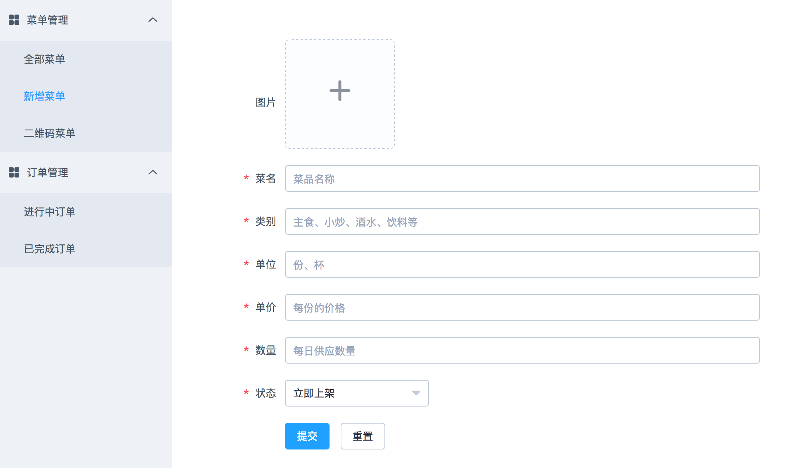
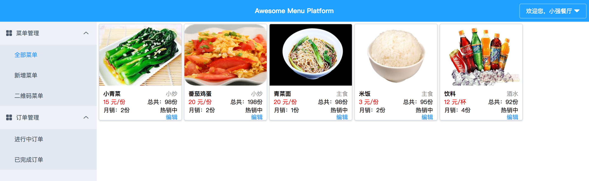
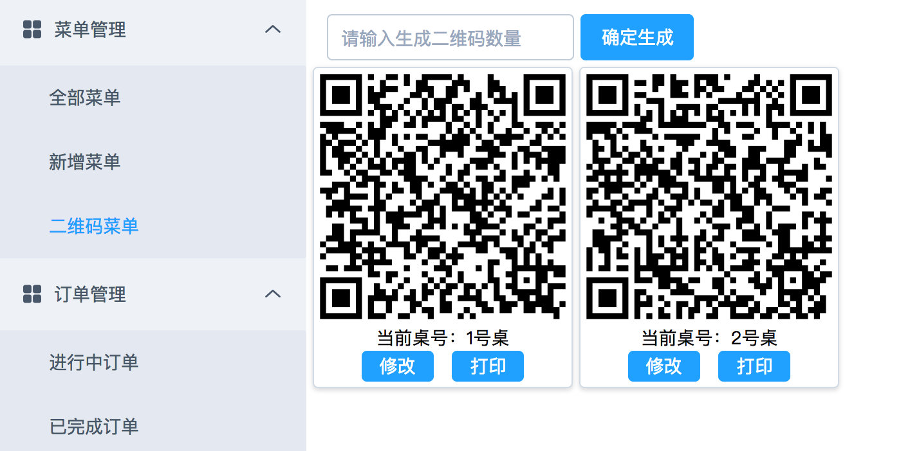
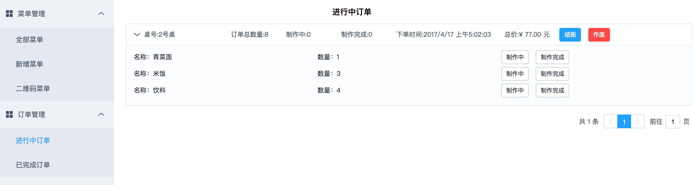
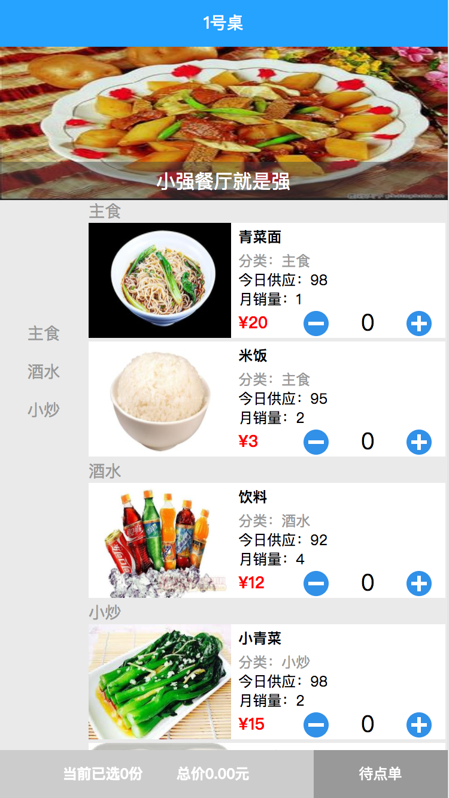
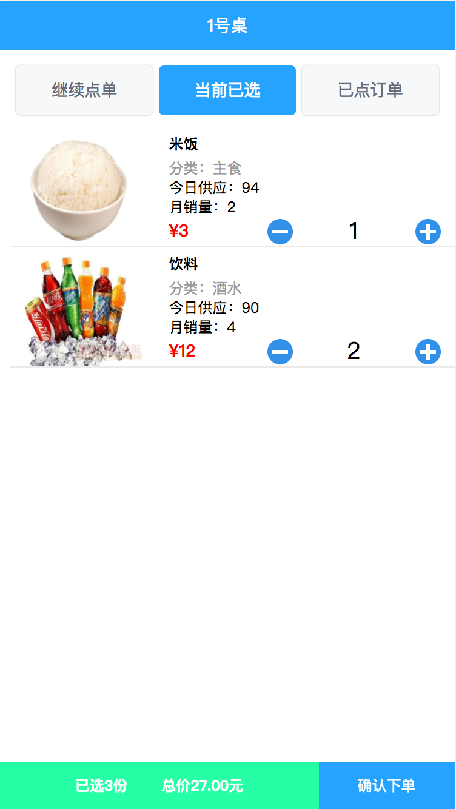
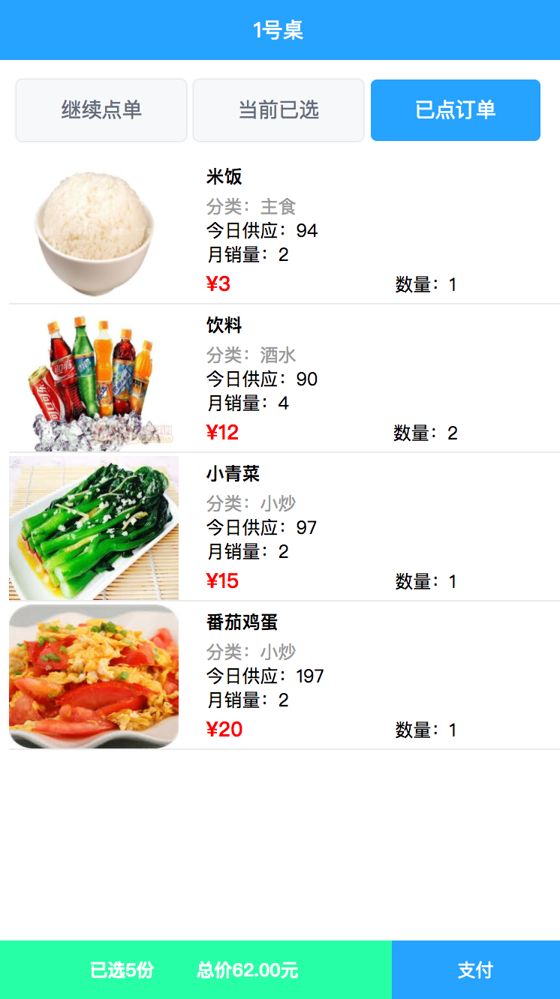

# A awesome online menu system

## 项目由来：
本项目是个人用来熟悉vue框架的练手项目，借助[element-ui](http://element.eleme.io/)完成ui部分。

后端为python flask提供API服务及业务逻辑处理。

整体结构划分为PC端和手机端两个部分：
* PC提供餐厅商家注册，发布二维码菜单以及管理订单功能,集成socketIo功能，点单变化后，订单页面自动获取数据更新。
* 手机端主要实现浏览器扫码后，在线浏览对应餐厅菜单，以及实现点单，下单等功能。

## 目录结构说明：
- backend: 后端目录
  - apis: 前端调用的API接口文件
  - configs: 开发环境配置，其中的DATASET_DATABASE_URI和SERVER_HOST根据实际开发情况设置
  - dataset: dataset的一个封装，原作者是Julien Goret，之前可以通过flask-dataset安装，后作者将项目移除。
  因本项目数据库处理部分是基于此的，因此直接置于项目目录(个人测试psql以及sqlite是没问题的，其他dataset支持的数据库应该也能支持。
  - models: 对应数据model的封装
  - static: 静态资源文件，生成的qrcode以及上传图片(upload)存放于此
  - templates: 模板文件，前端build后会生成至此
- frondend: 前端目录
  - app: 前端PC端目录
    - common: 公共方法目录
    - components: vue单文件组件
  - build: 前端文件build后的放置目录
  - mobile: 前端手机端目录
  - webpack: webpack配置，其中的baseUrl地址与后端SERVER_HOST地址一致即可

## 安装

``` bash
# 克隆代码后进行项目目录，安装前端依赖
npm install

# 启动前端服务
npm run dev

# 安装python依赖
pip install -r requirements/requirement.txt

# 启动后端服务，请先配置依赖的数据库
python manage.py runserver

# 访问端口
PC端为localhost:5000/admin_panel
手机端可通过扫面生成的菜单二维码获取地址,为localhost:5000/mobile_index?uid=生成的uid&table_id生成的table_id
```
## 其他
- 验证码什么的通过console查看
- 关于测试，有时间再说：）

## 相关截图 












## 采用的相关技术
- [vue-router](https://router.vuejs.org/zh-cn/)
- [vuex](https://vuex.vuejs.org/zh-cn/intro.html)
- [element-ui](http://element.eleme.io/)
- [flask](http://docs.jinkan.org/docs/flask/)

